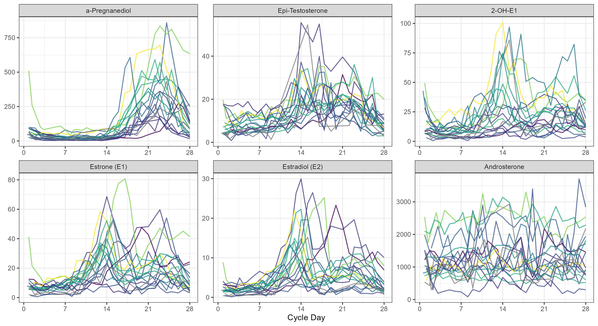
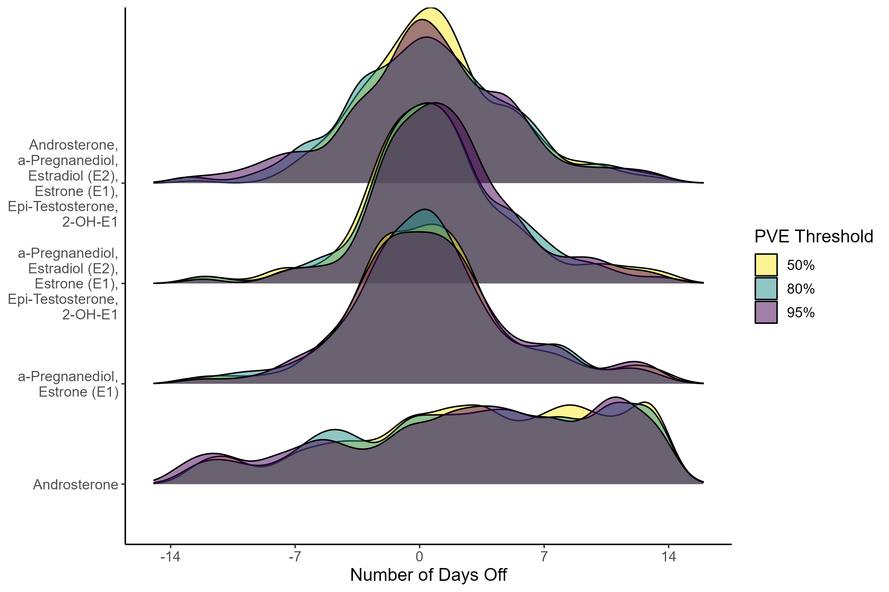
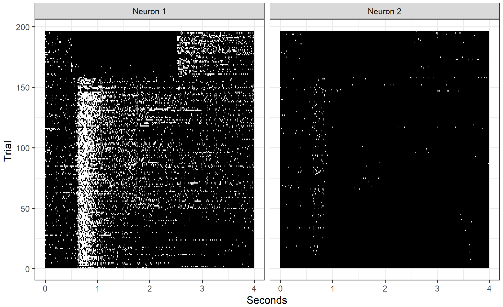
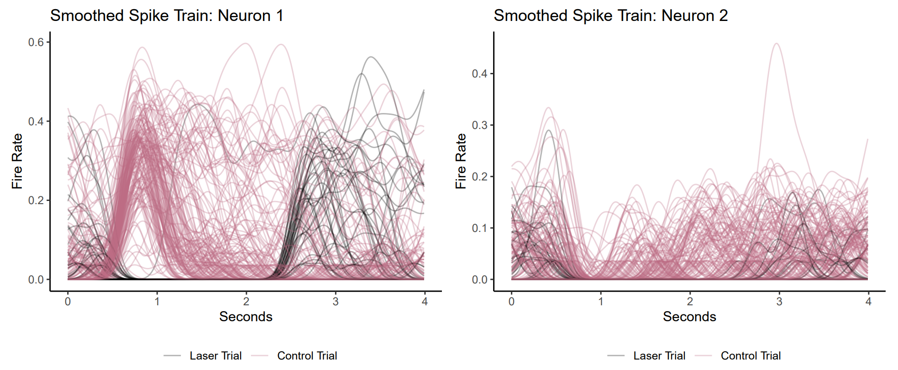

```{r setup, include=FALSE}
knitr::opts_chunk$set(echo = TRUE)
```

<br>

**Menstrual Cycle Day Prediction**

The menstrual cycle is an important source of variation that is routinely overlooked in studies involving women's health. We aim to provide an accurate estimate of menstrual cycle day (i.e. number of days since the start of the cycle) using hormone values derived from a single cross-sectional urine sample. Using a unique study that followed a sample of women over a complete cycle, we construct a latent cycle day based on observed hormone levels. Below are two figures illustrating the performance of our technique. The left figure shows a sample of extracted hormones across a full menstrual cycle. The right figure displays the estimation errors resulting from our method performed using various sets of hormones and PVE levels. Using $\alpha$-Pregnanediol and Estrone, we estimate the cycle day within three days of the truth in 75\% of scenarios. Additionally, you can check out this [dashboard](https://ms5975.shinyapps.io/methods_illustration/) which illustrates our method using simulated data! 

<br>

{width=55%}
{width=40%}

**Software**: [Cycle Day Estimation](https://github.com/madison-stoms/cycle_day_estimation)


<br>

**Functional Clustering Across Repeated Trials**

Using a functional data framework, we aim to analyze neural firing rates collected from a trained mouse. The rates are obtained as the mouse reaches for a food pellet on a number of trials under different scenarios. The left panel shows a subset of firing rates across a four second time domain from two neurons across two trial types. The right panel shows the smoothed versions of the spike train data, colored by trial type. We aim to identify interpretable clusters of neurons and decompose the group-specific firing rates while preserving the inherent differences in activation between the trial types. This knowledge allows us to deepen our understanding of how the motor cortex affects skilled movements.

<br>

{width=38%}
{width=60%}

**Software**: [Functional Repeated Trial Clustering](https://github.com/madison-stoms/repeated_trial_clustering)


